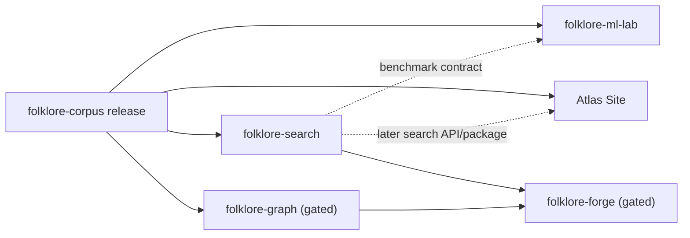

# Repository Split Handoff

Status: ready for approval; not executed
Prepared: 2026-07-24

## Decision

The first split should create three useful repositories, not five empty shells:

1. `folklore-corpus`
2. `folklore-search`
3. `folklore-ml-lab`

The existing Atlas Site remains the incubation history and thin visual
consumer. `folklore-graph` and `folklore-forge` stay named, documented future
projects until stable workloads justify them.

## Ownership

### `folklore-corpus`

- `data/raw/`
- `data/derived/releases/`
- `schemas/`
- `docs/dataset-card-v0.1.md`
- corpus compiler, audit, and release validator
- corpus and release-contract tests

Publishes immutable `corpus-vX.Y.Z` release archives. It owns IDs, aliases,
lineage, release manifests, and compatibility policy. It does not own search
scores, model weights, or UI behavior.

### `folklore-search`

- `benchmarks/search-v0.1/`
- BM25F library and corpus-search CLI
- benchmark runner
- `reports/search/`
- retrieval tests and result contract

Consumes a pinned Corpus Release. It publishes benchmark versions and search
run artifacts. It never silently modifies Corpus records or turns relevance
scores into cultural assertions.

### `folklore-ml-lab`

- `folklore_ml/`
- `ml/data/` preparation contract
- `ml/runs/`
- tiny-transformer trainer
- Python/Node dependency locks
- ML artifact tests

Consumes a pinned Corpus Release and, when relevant, a pinned Search benchmark.
It publishes experiment manifests, metrics, predictions, checkpoints, samples,
and cards. A promoted model must beat its declared controls on frozen inputs.

### Atlas Site

- `src/`, `public/`, deployment configuration, and visual tests
- consumes `compatibility/folklore-corpus.json`
- does not compile the canonical corpus after separation

## Dependency direction

No reverse dependency into Corpus is allowed.

## Split procedure

1. Tag this monorepo checkpoint as the shared fixed point.
2. Create repositories without adding independent schemas or placeholder APIs.
3. Preserve file history with filtered copies from the fixed point.
4. Add each consumer's pinned Corpus Release reference and checksum.
5. Run the same validation commands in the new repository.
6. Publish Corpus v0.1.0 first, then Search and ML Lab against its immutable
   release digest.
7. Change the Site compiler step into a release-consumption step.
8. Archive this handoff document in all three repositories.

## Acceptance before pushing

- Corpus rebuild is byte-identical and all raw digests, raw spans, references,
  counts, and artifact hashes validate.
- Search reproduces the checked-in v0.1 metrics and every result terminates in a
  valid Passage ID.
- ML preparation reproduces the task digest; checked-in runs pass
  `python -m folklore_ml verify`.
- Each repository has one clear command path and no copied mutable source of
  truth owned by another repository.
- No Graph or Forge repository is created merely to reserve a name.

Actual GitHub repository creation, history filtering, remotes, release uploads,
and access settings are intentionally outside this checkpoint and require the
next approval.
